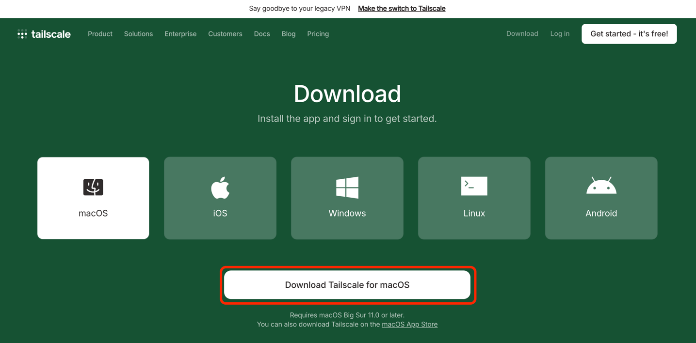
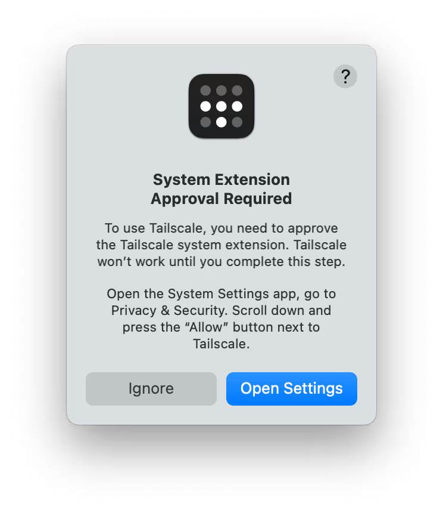
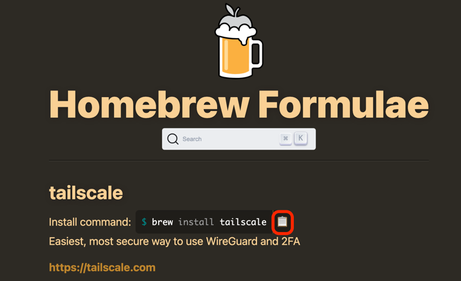
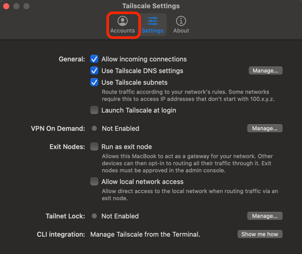
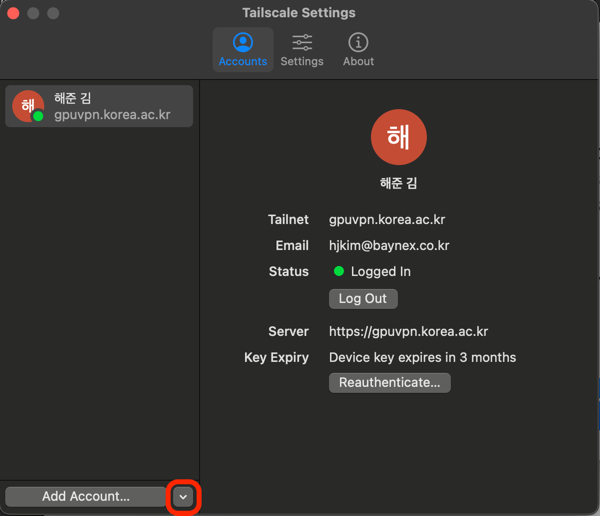
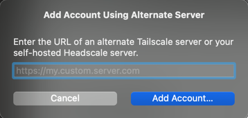

# GPU Cloud 사용을 위한 VPN 설치
GPU Cloud를 사용하기 위해서 tailscale 클라이언트 프로그램을 이용합니다.  
단, tailscale 서버를 이용하지 않고 GPU Cloud 전용 서버를 이용하기 때문에 세팅 방법이 조금 다릅니다.

대표적으로 많이 사용하는 macOS와 Windows를 기준으로 설명드립니다.  
기타 다른 os의 설치 방법은 링크를 확인해주세요. -- 링크 첨부

## macOS

### Install
Mac OS에서 Tailscale을 설치해보겠습니다.
설치하는 방법에는 Tailscale의 홈페이지에서 **사용자의 OS에 맞는 Application을 설치**하거나 
**brew**라고 하는 mac os에서 사용하는 패키지 매니저를 사용하여 설치하는 방법이 있습니다.   
해당 문서에서는 macOS를 기준으로 설명하도록 하겠습니다.

#### App Application
[Tailscale homepage](https://tailscale.com/download)에 접속하면 다음과 같은 화면을 확인하실 수 있습니다.

위 화면에서 사용자의 OS에 맞는 애플리케이션을 선택한 후 `Download Tailscale for macOS` 버튼을 눌러 설치를 진행합니다.  
설치가 완료된다면 다운로드 된 `.pkg` 파일을 실행시켜 설치를 완료하도록 합니다.

⚠️ **주의:** 네트워크 확장 프로그램 권한을 허용하지 않으면 Tailscale이 정상 작동하지 않을 수 있습니다.  
혹시 아래의 이미지와 같은 안내 문구가 발생했다면 [링크](https://tailscale.com/kb/1340/macos-sysext)를 참고하여 os version에 맞게 권한을 허용해주어야 합니다.

#### Brew를 이용한 설치
[brew](https://brew.sh) 사이트를 접속한 후 tailscale을 검색하여 줍니다.
  
위의 사진에 표시된 부분을 선택하여 명령어를 복사한 후 터미널에 입력해주면 자동으로 패키지 설치가 완료됩니다.  
설치가 완료되면 `tailscale version` 명령어를 실행하여 설치가 정상적으로 완료됐는지를 확인합니다.  
아래와 같이 표기된다면 설치는 정상적으로 완료된 것입니다.

    tailscale version
    1.80.1

설치가 완료되었다면 `tailscale up` 커맨드를 입력(permission 관련 에러가 발생시 `sudo tailscale up` 입력)하여 tailscale을 실행시켜줍니다.

### Sign In
이제 계정을 등록해보겠습니다.  

설치된 tailscale 앱을 실행시켜주고 **Settings**화면(`cmd + ,`)에서 **Accounts**를 선택합니다.  

이후 상기의 이미지에 표시된 부분을 선택한 후에 부여받은 URL(ex, https://gpuvpn.korea.ac.kr)을 입력하면 정상적으로 계정 등록이 완료됩니다.   
이제 `tailscale status` 커맨드를 통해 등록 여부를 확인할 수 있습니다.
    